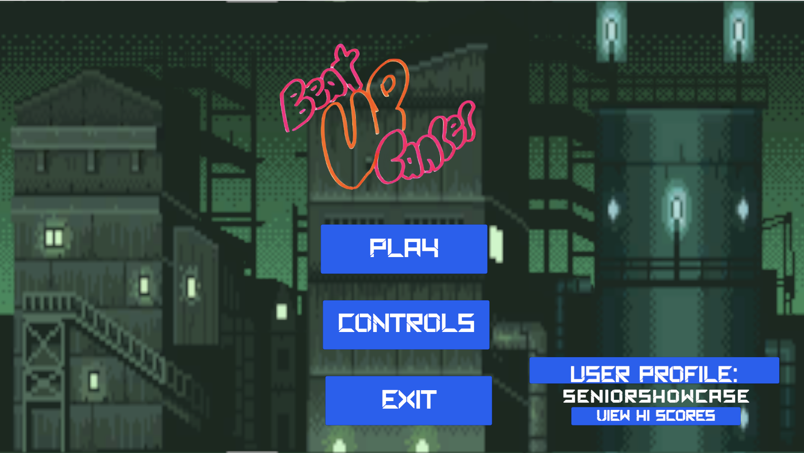

#  Beat Up Cancer Game

### Inference image

##  Created By

**Radio Active Studios**  Created on: **September 19, 2024** - **May 30, 2025**

## Description

**Beat Up Cancer** is a 2D action-platformer that blends dynamic gameplay with educational cancer awareness. Designed as both an engaging experience and a tool for empowerment, players fight symbolic representations of cancer using powerful moves, learn facts before each level, and face the consequences of leaving cancer cells untreated.

Whether you're a patient, supporter, or just looking for a unique game with a purpose — this game transforms learning into action.

---

##  MVP Features

-  **Three Playable Characters** — Each with unique special moves and animations.
-  **Basic Attacks & Movement** — Intuitive controls for movement, melee, and ranged combat.
-  **Special Moves** — Unique special abilities for each character (Q, E, R).
-  **At least 2 Simple Enemies** — Representing different types of cancer cell behaviors.
-  **Info Screen Before Each Stage** — Learn about cancer facts and stats before fighting.
-  **Progression System** — Advancing stages with increasing difficulty and consequences.
-  **Untreated Cells Mechanic** — Skipping cancer cells affects progression/outcomes.
-  **Timer for Each Stage** — Adds pressure and a sense of urgency to the fight.
-  **Power-Ups (x2 Types)** — Collect and use boosts to heal or enhance attack.
-  **Level 3 Implemented** — Fully playable third level with boss or stage climax.
- **UI Damage Indicator** — Visual UI showing player health and damage taken.

---

##  Product Demo

👉 **Play Now:** [https://wanguijohn.itch.io/beatupcancer](https://wanguijohn.itch.io/beatupcancer)

---

##  Controls

| Key           | Action              |
|------------   |---------------------|
| Up Arrow      | Jump                |
| Left Arrow    | Move left           |
| Right Arrow   | Move Right          |
| Z             | Attack 1            |
| X             | Attack 2            |
| C             | Attack 3            |
| V             | Special  Attack     |
| P             | Skip text crawler   |

---

##  Technologies Used

- **Unity Engine (2D)**
- **Visual Studio**
- **C#** Scripting
- **GitHub** (Version Control & Collaboration)
- **Open Game ART** (Sprite Art)
- **Itch.io** for WebGL Distribution

---

##  License

This project is licensed the [MIT license](https://opensource.org/licenses/MIT).

---

## Support the Project

If you’re a designer, developer, educator, or healthcare expert interested in collaborating, feel free to open an issue or reach out!

> 💬 *"Beat cancer, one level at a time."*

